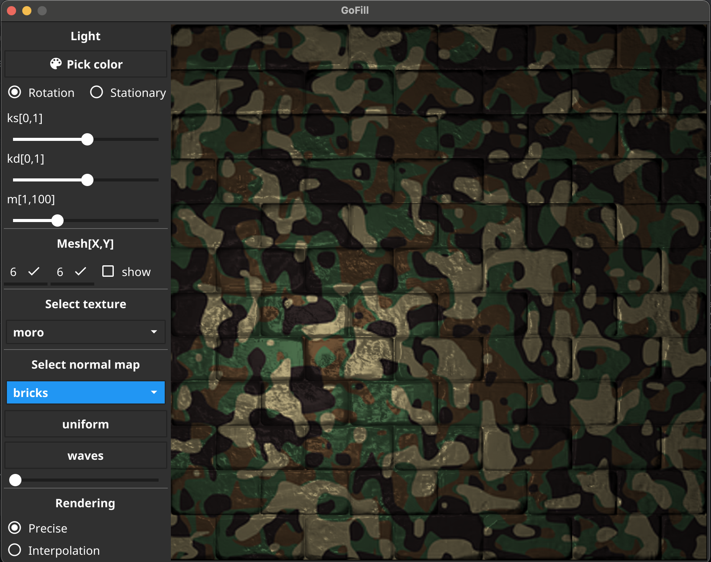

# GoShape
GoShape is my university project from Computer Graphics.

It is the second in the series, and I had the most fun with this one. It explores lambert light model and its inticacies in 2D (pseudo-3D) rendering.
It also showed, that golang is quite snappy - the animations are quite smooth compared to the ones achieved by my colleagues in C#.

Feel free to experiment and try to not see some of buggy behaviours!




Written in pure go. To run, you need to have go 1.15+ installed:
```
go run .
```
